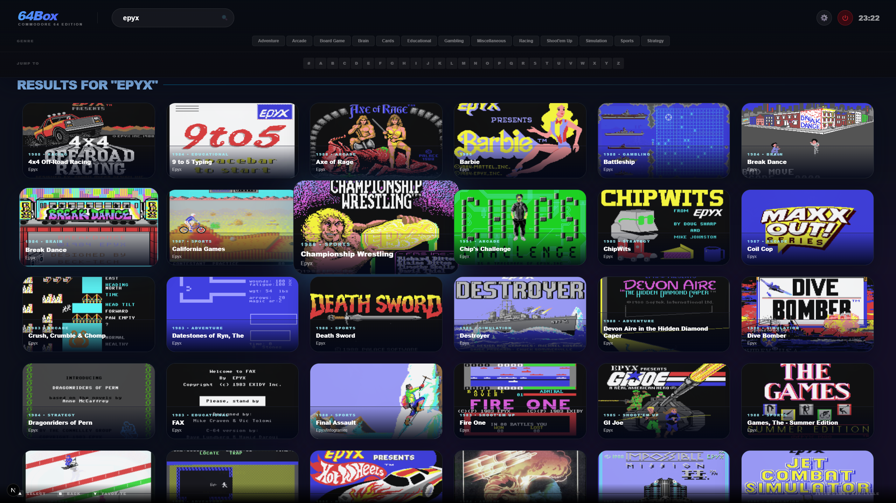
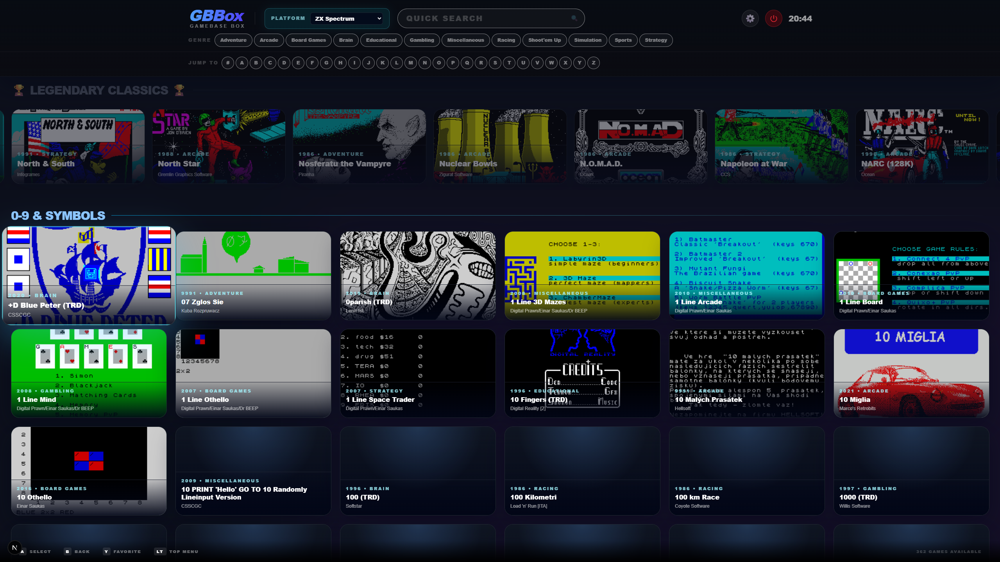
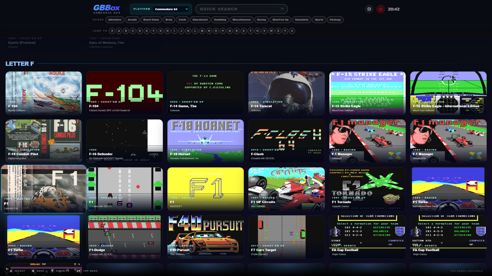
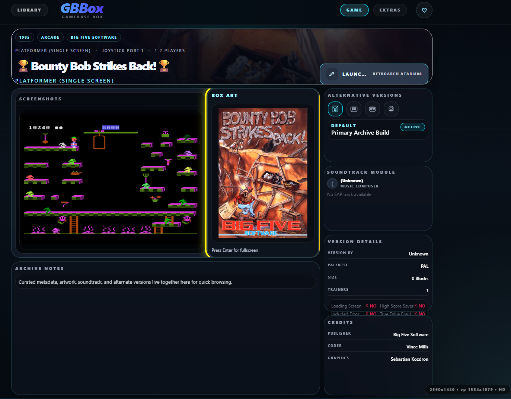
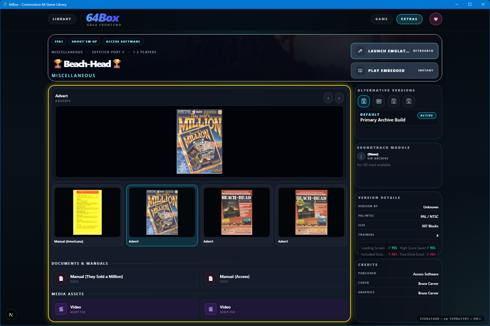
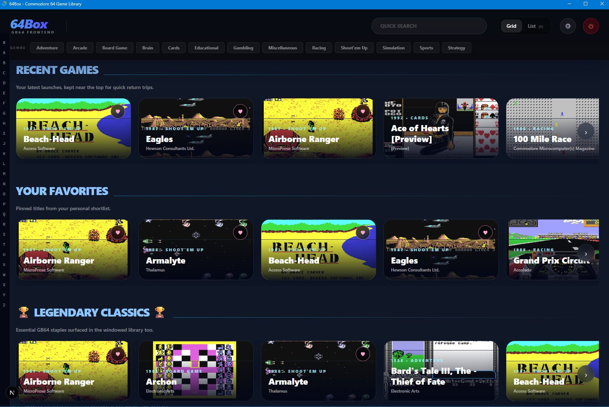
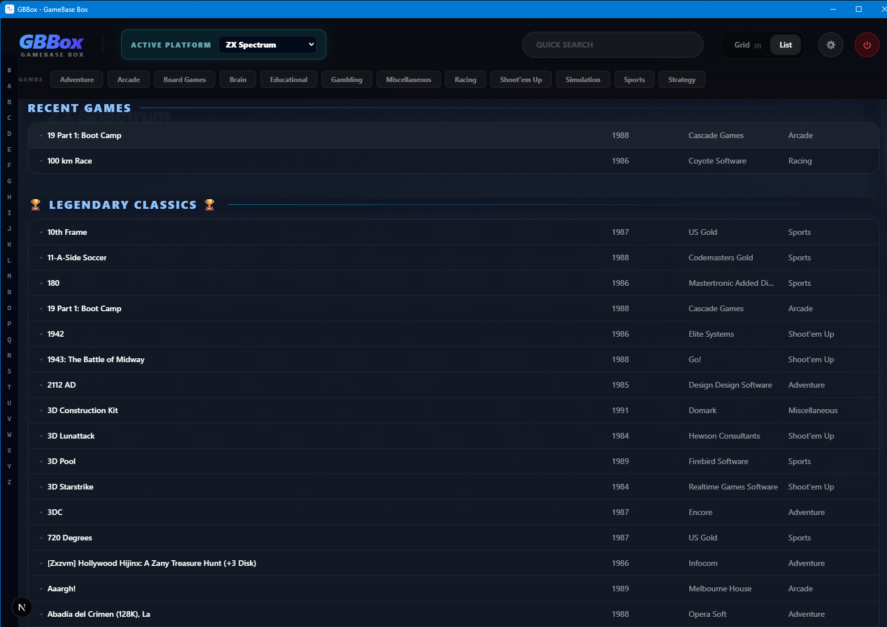

# GBBox

**GameBase Box** is a local-first desktop frontend for GameBase-style retro game libraries. It started life as 64Box for the GameBase64 collection and now supports platform-scoped imports for **Commodore 64, Atari 800, Atari 2600, ZX Spectrum, Acorn BBC Micro, and Commodore Amiga**, with more GameBase platforms coming soon.

> Formerly 64Box. The new public repository is [GameBaseBox](https://github.com/ejber-ozkan/GameBaseBox).

## Download

Download the latest GBBox build from the platform links below, or browse the full [GitHub Releases page](https://github.com/ejber-ozkan/GameBaseBox/releases/latest).

<table>
  <tr>
    <td align="center">
      <a href="https://github.com/ejber-ozkan/GameBaseBox/releases/latest/download/GBBox-Windows-x64-Setup.exe">
        <br>
        Windows
      </a>
    </td>
    <td align="center">
      <a href="https://github.com/ejber-ozkan/GameBaseBox/releases/latest/download/GBBox-Linux.AppImage">
        <br>
        Linux
      </a>
    </td>
    <td align="center">
      <a href="https://github.com/ejber-ozkan/GameBaseBox/releases/latest/download/GBBox-macOS.dmg">
        <br>
        macOS
      </a>
    </td>
  </tr>
</table>

## Supported Imports

| Platform | Status | Notes |
|----------|--------|-------|
| Commodore 64 / GameBase64 | Supported | Compatibility baseline with VICE, RetroArch, SID playback, extras, screenshots, and GameBase64 metadata. |
| Atari 800 | Supported | Imports Atari 800 v12-compatible GameBase MDBs with Games, Music, Photos, Screenshots, and Extras folders. Supports RetroArch Atari800 and Altirra launch settings. |
| Atari 2600 | Supported | Imports Atari 2600 GameBase MDBs with Games, Screenshots, and Extras folders. Uses RetroArch/Stella-style launch settings. |
| ZX Spectrum / GameBaseZX / SpeccyMania | Supported | Imports Sinclair ZX Spectrum v6-compatible GameBase MDBs with Extras, Games, Screenshots, Musician Photos, and Music folders. RetroArch is the default launch profile, with Spectaculator as an external emulator option. `.ay` music files are recognized as ZX Spectrum music media; in-app JavaScript playback still needs evaluation. |
| Acorn BBC Micro | Supported | Imports BBC Micro GameBase MDBs with Extras, Games, Screenshots, and Music folders. RetroArch is the default launch profile, with BeebEm as the external emulator option. |
| Commodore Amiga | Supported | Imports Amiga GameBase MDBs with Extras, Games, Screenshots, and Music folders. RetroArch is the default launch profile, with WinUAE on Windows and UAE-style equivalents such as FS-UAE or Amiberry on Linux/macOS. |
| More GameBase platforms | Coming soon | The platform model is now data-driven so additional GameBase databases can be added without cloning the app. |

GameBase database (`.mdb`) files, ROMs, screenshots, music, extras, and other media are not included. You point GBBox at the databases and local folders you own.

## Features

- **GameBase-style library frontend**: Browse imported collections in windowed mode or fullscreen BigBox mode.
- **Platform-scoped libraries**: Keep catalog data, media roots, emulator paths, favorites, and navigation state separate per platform.
- **Fast search and filtering**: Search by title and metadata, browse by genre/subgenre, and jump alphabetically through large collections.
- **Native emulator bridge**: Launch through VICE, RetroArch, Altirra, and platform-specific emulator profiles where supported.
- **In-app C64 emulation**: Play supported Commodore 64 games through the bundled EmulatorJS/VICE core.
- **Multi-file launch handling**: Generate temporary `.vfl` or `.m3u` launch artifacts for multi-disk and multi-file games.
- **Media and extras browsing**: View screenshots, box art, photos, manuals, maps, adverts, books, and other extras from local folders.

## Screenshots

### BigBox Search



### BigBox Rails



### BigBox Letter Jump



### Detail View: Gallery



### Detail View: Extras Gallery



### Window Mode: Grid View



### Window Mode: List View



## Controls and Shortcuts

### Controller

- **Library / Grid / List**: `D-pad` or `Left Stick` moves focus, `A` opens the focused game, `B` goes back or closes the current panel, `X` toggles Grid/List view, `Y` toggles favorite on the focused game, `LB` / `RB` jump by letter, and `Start` opens Settings.
- **BigBox**: `D-pad` or `Left Stick` moves through header rows, rails, and tiles, `A` activates the focused item, `B` goes back or exits the search field, `Y` toggles favorite on the focused game, `LB` / `RB` move between sections, and `Start` opens Settings.
- **Single Game Detail View**: `D-pad` or `Left Stick` moves between play buttons, gallery items, tabs, music player, and favorite button, `A` activates the focused item, `B` goes back, `Y` toggles favorite, and `LB` / `RB` switch tabs or media sections.
- **Settings**: `D-pad` or `Left Stick` navigates, `A` selects, `LB` / `RB` switch settings tabs, and `B` or `Start` saves and closes.

### Keyboard

- **Library / Grid / List**: `Arrow keys` move focus, `Enter` opens the focused game, `F` toggles favorite, `Shift+F` opens Filters, `V` toggles Grid/List view, `S` opens Settings, `PageUp` / `PageDown` jump by letter, and `Alt+Enter` toggles fullscreen.
- **BigBox**: `Arrow keys` navigate header rows, rails, and tiles, `Enter` activates the focused item, `F` toggles favorite, and `Esc` exits the search box or, when pressed twice quickly, exits the app.
- **Single Game Detail View**: `Arrow keys` navigate, `Enter` or `Space` activates the focused item, `F` toggles favorite, `Tab` / `Shift+Tab` or `PageUp` / `PageDown` or `[` / `]` switch tabs, and `Esc` or `Backspace` goes back.
- **Settings**: `Arrow keys` navigate, `Enter` selects, and `Esc` saves and closes.

## Prerequisites

- [Node.js](https://nodejs.org/en) v24+
- [Rust](https://rustup.rs/) for the Tauri backend
- [Tauri CLI prerequisites](https://tauri.app/2/guides/getting-started/prerequisites/)
- Linux packages on Ubuntu/Debian:

```bash
sudo apt update
sudo apt install libwebkit2gtk-4.1-dev build-essential curl wget libssl-dev libgtk-3-dev libayatana-appindicator3-dev librsvg2-dev mdbtools
```

## Setting up Platform Databases and Assets

### Commodore 64

1. Download the GameBase64 `GBC_v19.mdb` file from the [GameBase64 website](http://www.gamebase64.com/).
2. Prepare your local GameBase64 folders for Games, Screenshots, Photos, Music/SID, Extras, BoxArt, and Video where available.
3. In GBBox, import the database and configure **C64 Platform Paths** in Settings.

GBBox remains grateful to the GameBase64 project and GB64 Team for decades of Commodore 64 preservation. Visit [gb64.com](https://gb64.com/) for the original project.

### Atari 800

1. Obtain `Atari 800 v12.mdb` or an equivalent Atari 800 v12-compatible GameBase MDB.
2. Prepare folder roots for Games, Music, Photos, Screenshots, and Extras.
3. Select Atari 800 from the platform switcher. If it has not been imported, GBBox opens the Atari 800 import flow.
4. Configure Atari 800 launch paths under **Atari 800 Platform Paths**. RetroArch requires `retroarch.exe` plus an Atari800 libretro core; Altirra uses its own executable path.

### Atari 2600

1. Obtain an Atari 2600 GameBase MDB.
2. Prepare folder roots for Games, Screenshots, and Extras.
3. Select Atari 2600 from the platform switcher. If it has not been imported, GBBox opens the Atari 2600 import flow.
4. Configure RetroArch executable and Atari 2600 core paths under **Atari 2600 Platform Paths**.

### ZX Spectrum

1. Obtain `Sinclair ZX Spectrum v6.mdb` from a GameBaseZX / SpeccyMania-compatible collection.
2. Prepare folder roots for Extras, Games, Screenshots, Musician Photos, and Music.
3. Select ZX Spectrum from the platform switcher. If it has not been imported, GBBox opens the ZX Spectrum import flow and mentions both GameBaseZX and SpeccyMania.
4. Configure ZX Spectrum launch paths under **ZX Spectrum Platform Paths**. RetroArch is the default profile and typically uses a Fuse-compatible libretro core; Spectaculator can be configured as a secondary external emulator.
5. `.ay` music files are tracked as ZX Spectrum music media. In-app browser playback is not enabled yet; a JavaScript/WebAudio player needs a separate evaluation before it is surfaced in the UI.

### Acorn BBC Micro

1. Obtain a BBC Micro GameBase MDB.
2. Prepare folder roots for Extras, Games, Screenshots, and Music.
3. Select Acorn BBC Micro from the platform switcher. If it has not been imported, GBBox opens the BBC Micro import flow.
4. Configure BBC Micro launch paths under **Acorn BBC Micro Platform Paths**. RetroArch is the default profile and requires a BBC Micro-compatible libretro core; BeebEm can be configured as an external emulator.

### Commodore Amiga

1. Obtain a Commodore Amiga GameBase MDB.
2. Prepare folder roots for Extras, Games, Screenshots, and Music.
3. Select Commodore Amiga from the platform switcher. If it has not been imported, GBBox opens the Amiga import flow.
4. Configure Amiga launch paths under **Commodore Amiga Platform Paths**. RetroArch is the default profile and typically uses a PUAE-compatible libretro core; WinUAE can be configured on Windows, with UAE-style equivalents such as FS-UAE or Amiberry on Linux/macOS.

## Building the SQLite Database

GBBox converts GameBase Access (`.mdb`) exports into an optimized local SQLite database. The conversion step creates performance indexes, persisted cover lookup, platform library metadata, and full-text search support objects.

### Windows

Install the Microsoft Access Database Engine / Access ODBC components:

- [Microsoft Access Database Engine 2016 Redistributable](https://www.microsoft.com/en-us/download/details.aspx?id=54920)

Microsoft support for that download ended on October 14, 2025, but it remains the official source for the MDB export tooling used here.

```bash
.\scripts\import_gb64.bat
```

### Linux and macOS

Install dependencies, then run the audited import wrapper:

```bash
npm install csv-parse better-sqlite3
./scripts/import_gb64.sh
```

Manual conversion still works:

```bash
./scripts/mdb-export-all.sh ./GBC_v19.mdb
node ./scripts/convert_csv_to_sqlite.js
node ./scripts/check_sqlite_support.js
```

## Development

```bash
npm install

# Windows
.\tauri-dev.bat

# Linux/macOS
npm run tauri dev
```

## Production Build

```bash
# Windows
.\tauri-build.bat

# Linux/macOS
npm run tauri build
```

Build artifacts are written under `src-tauri/target/release/bundle/`.

## Post-Setup Configuration

Open **Settings** from the top header bar:

1. Configure each imported platform under its own **Platform Paths** page.
2. For C64, choose VICE or RetroArch and set the executable/core paths.
3. For Atari 800, choose RetroArch Atari800 or Altirra and set the required paths.
4. For Atari 2600, set RetroArch and the Atari 2600 core path.
5. For BBC Micro, choose RetroArch BBC Micro or BeebEm and set the required paths.
6. For Amiga, choose RetroArch Amiga or WinUAE/UAE and set the required paths.
5. Set media and extras folders for each platform so screenshots, photos, manuals, maps, and alternate versions resolve from your local collection.

Temporary extraction and launch playlists are generated outside your source library files and cleaned up as part of launch handling.

## Release Notes

See [CHANGELOG.md](CHANGELOG.md), [RELEASE_NOTES_0.4.0.md](RELEASE_NOTES_0.4.0.md), [RELEASE_NOTES_0.3.1.md](RELEASE_NOTES_0.3.1.md), [RELEASE_NOTES_0.3.0.md](RELEASE_NOTES_0.3.0.md), [RELEASE_NOTES_0.2.0.md](RELEASE_NOTES_0.2.0.md), and [RELEASE_NOTES_0.1.0.md](RELEASE_NOTES_0.1.0.md) for GBBox release notes.

## Skills used to build this

```bash
npx skills add https://github.com/vercel-labs/agent-skills --skill web-design-guidelines
npx skills add https://github.com/vercel-labs/agent-skills --skill vercel-react-native-skills
npx skills add https://github.com/vercel-labs/agent-skills --skill vercel-react-best-practices
npx skills add https://github.com/vercel-labs/agent-skills --skill vercel-composition-patterns
npx skills add https://github.com/vercel-labs/agent-skills --skill deploy-to-vercel
npx skills add https://github.com/bitxeno/sqlite-data-skill --skill 'SQLiteData Usage Guide'
npx skills add https://github.com/apollographql/skills --skill rust-best-practices
```

Project skills live in:

```bash
.agents/skills/gb64-metadata-parser
.agents/skills/rom-scanner-hashing
.agents/skills/wasm-c64-bridge
.agents/skills/tauri-architecture
```
